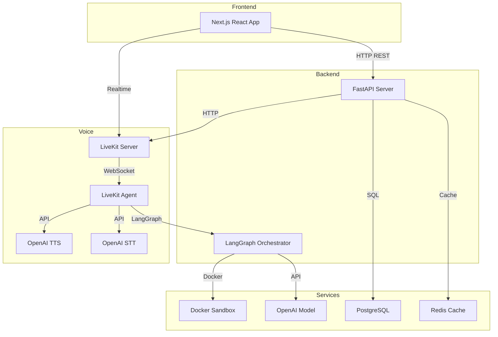

# InterviewLab

An AI-powered technical interview practice platform built with FastAPI, Next.js, LangGraph, and LiveKit.

This repository is presented as a portfolio project: it combines real-time interview orchestration, voice interaction, live coding, resume-aware prompts, and structured feedback in one product-shaped system.

<div align="center">
  
  <br/><br/>
  
  <br/><br/>
  
</div>

## Portfolio Summary

**Problem**

Most interview prep tools are either static question banks or chat-only demos. They usually miss three things that make practice feel realistic:

- real interview flow control
- voice-based interaction
- structured feedback tied to both answers and coding performance

**What this project does**

InterviewLab simulates a technical interview workflow with:

- AI-guided interview progression
- voice interview infrastructure
- live code execution in a sandbox
- resume-based personalization
- skill breakdown and feedback analytics

**Why it is a strong portfolio piece**

This project is not just a UI demo. It shows:

- multi-service system design
- backend orchestration with stateful interview flow
- real-time interaction architecture
- frontend product thinking
- fallback design for missing external services
- practical debugging and local validation work

---

## What I Changed

This repository started from the original InterviewLab codebase and was adapted into a more interview-ready, locally demonstrable portfolio project.

### Key improvements

1. **Repaired missing frontend foundation**
   - Added missing frontend utility and API client modules under `frontend/lib/`
   - Restored auth store, API wrappers, and shared helpers needed for the app to build and run

2. **Added local mock interview validation flow**
   - Introduced `LOCAL_MOCK_AI` to allow local end-to-end testing without a live OpenAI pipeline
   - Added mock response and feedback behavior so the interview lifecycle can still be demonstrated
   - Made it possible to validate the main product flow even when external AI services are unavailable

3. **Localized the user-facing product UI**
   - Converted the main user flows to Chinese for presentation and usability
   - Updated landing page, auth pages, dashboard, interview views, resume views, analytics labels, sandbox UI, and metadata assets

4. **Improved portfolio presentation**
   - Reframed the project around product value, architecture, validation status, and demo flow
   - Organized the repository so it is easier to explain in an interview setting

---

## Demo Flow

The most reliable demo path today is:

1. Register or sign in
2. Upload a resume
3. Create an interview session
4. Start the interview
5. Submit a text response
6. Continue through the mock interview loop
7. Complete the interview
8. Open feedback and skill breakdown views

This gives a stable walkthrough of the core product experience without requiring every external production dependency to be live.

---

## Architecture



### Core components

| Component | Technology | Responsibility |
| --- | --- | --- |
| Frontend | Next.js + React | Product UI, interview dashboard, resumes, analytics, live coding |
| API Layer | FastAPI | Auth, interviews, resumes, voice, sandbox, analytics endpoints |
| Orchestrator | LangGraph | Stateful interview flow, decisions, transitions, response generation |
| Voice Agent | LiveKit Agents | Real-time voice interview interaction |
| LLM Layer | OpenAI | Interview prompts, follow-ups, evaluation, feedback generation |
| Sandbox | Docker | Isolated code execution |
| Database | PostgreSQL / SQLite for local smoke flow | Persistence for interviews and related entities |
| Cache / Session Layer | Redis | Runtime coordination and caching in full deployment |

---

## Technical Highlights

### 1. Stateful interview orchestration

The interview is not treated like a simple chatbot. LangGraph is used to manage phase transitions such as greeting, questioning, follow-up behavior, coding, and closing.

### 2. Voice-first product direction

The system is designed around voice interaction through LiveKit, including room setup, speech handling, and AI agent participation.

### 3. Live coding workflow

The product includes a coding sandbox experience with editor, execution output, and interview-linked submission behavior.

### 4. Resume-aware interview context

Interview sessions can be connected to uploaded resumes so the product can personalize prompts and discussion areas.

### 5. Practical fallback engineering

A major portfolio strength here is not only the intended architecture, but also the ability to keep the project demonstrable when external services are incomplete.

---

## Current Validation Status

### Verified locally

- frontend builds successfully in the main local workflow
- backend health endpoint responds correctly
- register / login / create interview / start / respond / complete flow works in local mock mode
- feedback and skill breakdown endpoints return usable data in local validation mode
- major user-facing pages were localized and browser-checked

### Not fully validated yet in true production mode

These parts depend on external infrastructure being available:

- real OpenAI interview generation and scoring
- LiveKit real-time voice room flow
- Docker-isolated execution in full runtime conditions
- PostgreSQL + Redis production-style persistence path

That means the project is already strong as a portfolio system demo, while still having a clear roadmap for full production validation.

---

## Interview Talking Points

If you are reviewing this project in an interview, the strongest discussion areas are:

- how the interview state machine is modeled
- how frontend and backend responsibilities are split
- how to make an AI product demonstrable before every external dependency is ready
- how mock mode reduces integration risk while preserving product validation
- how voice, orchestration, sandbox execution, and analytics fit together in one application

---

## Project Structure

```text
InterviewLab/
├── src/                     # Backend application
│   ├── agents/              # LiveKit agent logic
│   ├── api/                 # REST API endpoints
│   ├── core/                # Config, auth, database utilities
│   ├── models/              # Database models
│   ├── schemas/             # Validation schemas
│   └── services/            # Orchestration, analysis, execution, analytics, voice
├── frontend/                # Next.js application
│   ├── app/                 # App routes
│   ├── components/          # UI components
│   ├── hooks/               # React hooks
│   └── lib/                 # API clients, store, helpers
├── docs/                    # Technical documentation
├── alembic/                 # Database migrations
├── docker-compose.yml       # Local service orchestration
├── Dockerfile               # Backend image
├── Dockerfile.agent         # Agent image
└── pyproject.toml           # Python dependencies
```

---

## Tech Stack

### Backend

- FastAPI
- Python 3.11+
- LangGraph
- SQLAlchemy
- Alembic
- OpenAI
- LiveKit Agents
- PostgreSQL
- Redis
- Docker

### Frontend

- Next.js
- React
- TypeScript
- Tailwind CSS
- Zustand
- TanStack Query
- Monaco Editor
- Framer Motion
- LiveKit Client

---

## Quick Start

### Backend

```bash
python -m uvicorn src.main:app --host 127.0.0.1 --port 8000
```

### Frontend

```bash
cd frontend
npm install
npm run dev
```

### Local portfolio demo mode

For local validation without full external AI services, use the environment setup that enables:

```env
LOCAL_MOCK_AI=true
DATABASE_URL=sqlite+aiosqlite:///./local_dev_interviewlab.db
```

This mode is intended for demonstration and smoke testing, not as a substitute for full production integration.

---

## Full Production Validation Path

To fully validate the intended architecture, the next steps are:

1. disable `LOCAL_MOCK_AI`
2. configure a real OpenAI API key
3. connect a working LiveKit environment
4. validate Docker sandbox execution end to end
5. switch to PostgreSQL + Redis for production-style testing

---

## Documentation

- [Architecture](docs/ARCHITECTURE.md)
- [API Reference](docs/API.md)
- [Frontend Guide](docs/FRONTEND.md)
- [Voice Infrastructure](docs/VOICE_INFRASTRUCTURE.md)
- [LangGraph Notes](docs/LANGGRAPH.md)
- [Local Development](docs/LOCAL_DEVELOPMENT.md)
- [Deployment](docs/DEPLOYMENT.md)

---

## License

GNU General Public License v3.0
