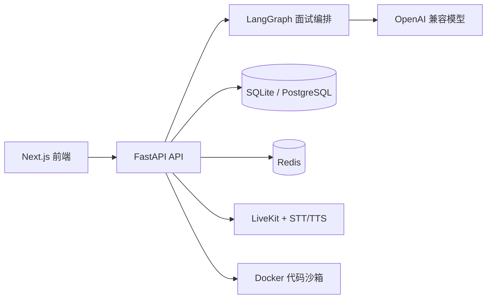

<div align="center">

# InterviewLab

### AI 技术面试训练与反馈平台

用 FastAPI、Next.js 与 LangGraph 组织面试流程，连接简历上下文、在线编程、语音基础设施和结构化反馈。

[](pyproject.toml)
[](frontend/package.json)
[](docker-compose.yml)
[](#测试与验证)
[](LICENSE)

**注册登录 → 创建面试 → 回答与代码提交 → 完成面试 → 获取反馈**

</div>

> InterviewLab 把一次技术面试拆成可恢复的状态流程，并提供本地 Mock AI 模式，让核心产品闭环在没有外部密钥时也能运行和验收。

## 快速导航

[项目预览](#项目预览) · [核心能力](#核心能力) · [架构](#架构) · [快速开始](#快速开始) · [配置](#配置) · [接口入口](#接口入口) · [测试与验证](#测试与验证) · [边界与路线图](#边界与路线图)

## 项目预览

<div align="center">
  
  <br/><br/>
  
  <br/><br/>
  
</div>

以上图片来自仓库内的实际界面素材；本地 Mock 流程验证记录见项目工作台和 `docs/LOCAL_DEVELOPMENT.md`。

## 项目定位

InterviewLab 面向技术面试训练场景，覆盖面试会话、简历关联、问题编排、在线代码提交和反馈分析。后端通过状态化编排区分问候、提问、追问、编码与收尾阶段；前端提供注册、Dashboard、面试详情、简历和分析页面。

## 核心能力

| 模块 | 能力 | 当前状态 |
| --- | --- | --- |
| 会话流程 | 创建、开始、回答、完成、反馈、技能拆解 | 本地 Mock 已验证 |
| Agent 编排 | LangGraph 状态节点与上下文传递 | 代码已集成 |
| 代码面试 | 代码提交、执行结果与质量分析 | 本地 Mock 已验证 |
| 简历上下文 | 上传简历并关联面试 | 页面与接口已提供 |
| 语音基础设施 | LiveKit 房间、STT/TTS、Agent 入会 | 需外部服务 |
| 数据层 | SQLite 本地冒烟，PostgreSQL/Redis 生产配置 | 分层支持 |

## 架构



## 快速开始

环境要求：Python 3.11+、Node.js 18+、npm；使用本地 Mock 模式不需要 OpenAI、LiveKit、PostgreSQL 或 Redis 服务。

### 1. 启动后端（PowerShell）

```powershell
Set-Location E:\Agent\AIProjects\Project002_InterviewLab\02_Source\InterviewLab
$env:LOCAL_MOCK_AI = "true"
$env:DATABASE_URL = "sqlite+aiosqlite:///./local_dev_interviewlab.db"
E:\Agent\AIProjects\Project002_InterviewLab\.venv\Scripts\python.exe -m uvicorn src.main:app --host 127.0.0.1 --port 8000
```

也可以直接执行仓库脚本：`./start_local_mock_backend.ps1`。健康检查：`http://127.0.0.1:8000/health`。

### 2. 启动前端

```powershell
Set-Location E:\Agent\AIProjects\Project002_InterviewLab\02_Source\InterviewLab\frontend
npm install
npm run dev -- -p 3000
```

打开 `http://localhost:3000`，按“注册 → 创建面试 → 开始 → 文本回答 → 完成 → 反馈”体验主流程。

### 3. Docker Compose（生产近似环境）

```powershell
Set-Location E:\Agent\AIProjects\Project002_InterviewLab\02_Source\InterviewLab
docker compose config --quiet
docker compose up -d --build
```

Compose 需要按 `.env.example` 提供 OpenAI、LiveKit、数据库和 Redis 配置；未配置外部服务时，优先使用上面的本地 Mock 方式。

## 配置

| 变量 | 作用 | 本地建议 |
| --- | --- | --- |
| `LOCAL_MOCK_AI` | 使用本地确定性面试与反馈 | `true` |
| `DATABASE_URL` | 数据库连接串 | SQLite |
| `OPENAI_API_KEY` | 真实模型调用 | 不写入仓库 |
| `LIVEKIT_URL` | 语音房间地址 | 本地或目标环境 |
| `REDIS_URL` | 缓存与任务协调 | 本地或目标环境 |

## 接口入口

| 方法 | 路径 | 说明 |
| --- | --- | --- |
| GET | `/health` | 后端健康检查 |
| POST | `/api/v1/auth/register` | 注册用户 |
| POST | `/api/v1/auth/login` | 登录并获取令牌 |
| POST | `/api/v1/interviews` | 创建面试 |
| POST | `/api/v1/interviews/{id}/start` | 开始面试 |
| POST | `/api/v1/interviews/{id}/respond` | 提交文本回答 |
| POST | `/api/v1/interviews/{id}/complete` | 完成面试并生成反馈 |
| GET | `/api/v1/interviews/{id}/feedback` | 查看反馈 |

完整接口以 `docs/API.md` 和运行中的 OpenAPI 文档为准。

## 测试与验证

已验证内容：

- Python 关键模块编译检查通过。
- 前端 `npm run build` 通过。
- 本地 Mock 链路：注册、登录、创建、开始、回答、完成、反馈、技能拆解。
- 后端 `/health` 返回 `healthy`。
- 首页、注册、Dashboard、面试列表和详情页面完成浏览器检查。

验证边界：真实 OpenAI 生成、LiveKit 语音房间、完整 Docker 沙箱、PostgreSQL/Redis 生产链路仍需目标服务和凭证，未将其写成已完成部署。

## 项目结构

```text
src/                  FastAPI 后端、Agent、服务与数据模型
frontend/             Next.js 前端与页面素材
docs/                 架构、API、语音与部署说明
alembic/              数据库迁移
Dockerfile            后端镜像
Dockerfile.agent      语音 Agent 镜像
docker-compose.yml    本地服务编排
```

## 边界与路线图

当前仓库已具备可运行的本地产品闭环；仍需服务器适配的项目包括真实模型密钥管理、LiveKit/STT/TTS、生产 PostgreSQL 与 Redis、Docker 代码沙箱隔离、HTTPS 和监控告警。

后续路线：补齐真实语音端到端验收、完善生产数据迁移与备份、增加 CI 测试矩阵，并持续清理前端构建警告。

## 贡献、许可证与安全

欢迎通过 Issue 反馈问题或提交 Pull Request。提交前请运行本地测试，不要提交 `.env`、访问令牌、API 密钥、数据库文件或生成缓存。安全问题请按仓库 `SECURITY.md` 的方式私下报告。

本项目使用 [GNU GPL v3.0](LICENSE)。
